<picture>
  <source
    media="(prefers-color-scheme: dark)"
    srcset="./profile-dark-v3.svg"
  >
  <source
    media="(prefers-color-scheme: light)"
    srcset="./profile-light-v3.svg"
  >
  
</picture>

  <a href="https://github.com/sekooo-ctrl">
    GitHub
  </a>
  &nbsp;•&nbsp;
  <a href="https://www.linkedin.com/in/serkan-osman-%C3%A7akmak-9957ab326/">
    LinkedIn
  </a>
  &nbsp;•&nbsp;
  <a href="mailto:osmanserkan22cakmak@gmail.com">
    Email
  </a>

