<picture>
  <source media="(prefers-color-scheme: dark)" srcset="./profile-dark-stable.svg">
  <source media="(prefers-color-scheme: light)" srcset="./profile-light-stable.svg">
  
</picture>

  
  
  

---

# 👋 About Me

### 🇹🇷 Turkish

Merhaba! Ben **Serkan Osman Çakmak**.

**Sakarya Üniversitesi Bilgisayar Mühendisliği** öğrencisiyim.

Şu anda **Java** öğreniyor ve **Backend Development** alanında kendimi geliştirmeye odaklanıyorum.

Bunun yanında **C#**, **C++** ve **SQL** konularında temel bilgiye sahibim. Öğrendiklerimi küçük projeler geliştirerek pratiğe dökmeyi ve her gün kendimi biraz daha geliştirmeyi hedefliyorum.

Hedefim güçlü bir yazılım temeli oluşturmak, gerçek dünya problemlerine çözüm üreten projeler geliştirmek ve gelecekte backend alanında uzmanlaşmış bir yazılım geliştiricisi olmak.

---

### 🇬🇧 English

Hi! I'm **Serkan Osman Çakmak**.

I'm a **Computer Engineering** student at **Sakarya University**.

Currently, I'm learning **Java** while focusing on **backend development**.

I also have basic knowledge of **C#**, **C++**, and **SQL**. I enjoy applying what I learn by building small projects and continuously improving my programming and problem-solving skills.

My goal is to build a strong software engineering foundation, develop real-world applications, and become a backend software engineer.

---

# 💡 What I'm Working On

### 🇹🇷 Turkish

- Java öğreniyorum.
- Backend geliştirme üzerine çalışıyorum.
- SQL bilgilerimi geliştiriyorum.
- Veri Yapıları ve Algoritmalar çalışıyorum.
- Küçük projeler geliştirerek pratik yapıyorum.

---

### 🇬🇧 English

- Learning Java.
- Exploring backend development.
- Improving my SQL knowledge.
- Studying Data Structures & Algorithms.
- Building small projects to gain practical experience.

---

# 🛠 Tech Stack

  

---

# 📚 Currently Learning

### 🇹🇷 Turkish

- Java
- Nesne Yönelimli Programlama (OOP)
- Backend Development Temelleri
- SQL ve Veritabanı Tasarımı
- Veri Yapıları ve Algoritmalar

---

### 🇬🇧 English

- Java
- Object-Oriented Programming (OOP)
- Backend Development Fundamentals
- SQL & Database Design
- Data Structures & Algorithms

---

### Thanks for visiting my profile!

*Learning every day, building one project at a time.*

